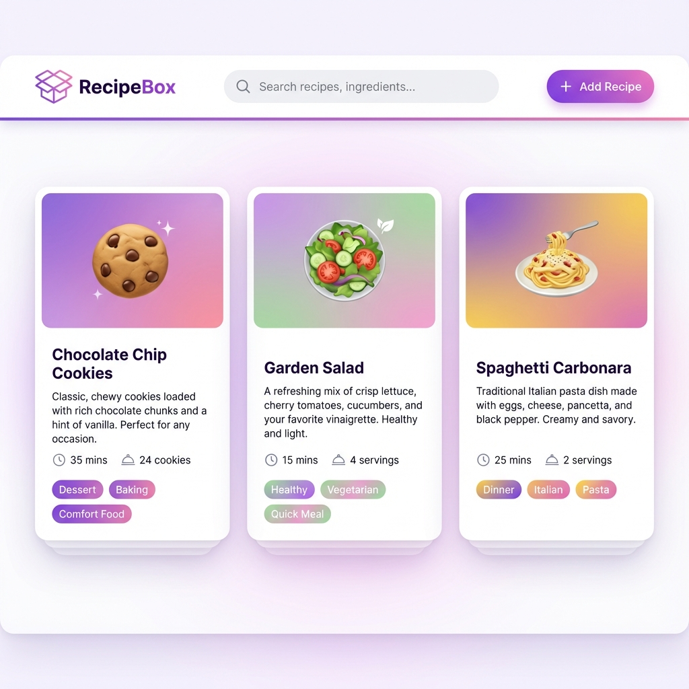

# Recipe Storage Web App - Walkthrough

A beautiful, modern recipe storage application built with vanilla HTML, CSS, and JavaScript. This MVP provides a solid foundation for managing family recipes with room to grow into advanced features.

## 🎯 Project Overview

**Location**: `/Users/giladsapir/.gemini/antigravity/scratch/recipe-app/`

**Technology Stack**:
- HTML5 (semantic, accessible markup)
- CSS3 (custom properties, modern layouts, animations)
- JavaScript ES6+ (modules, localStorage)
- **No frameworks or dependencies** - pure vanilla web technologies

**Purpose**: A simple yet powerful recipe management system for family use, designed with extensibility in mind for future cloud sync, meal planning, and shopping list features.

### Design Preview



---

## ✅ Features Implemented

### Core Recipe Management
- ✅ **Create recipes** - Comprehensive form with dynamic ingredient/instruction fields
- ✅ **Read recipes** - Beautiful card grid and detailed modal view
- ✅ **Update recipes** - Edit any recipe with pre-populated form
- ✅ **Delete recipes** - Delete with confirmation prompt
- ✅ **Search recipes** - Real-time search across titles, ingredients, and tags
- ✅ **Filter by category** - Quick category chips (All, Breakfast, Lunch, Dinner, etc.)

### Data Management
- ✅ **LocalStorage persistence** - All data saved to browser localStorage
- ✅ **Sample data** - Pre-loaded with 3 example recipes for better UX
- ✅ **Data validation** - Form validation ensures data integrity
- ✅ **Export-ready architecture** - Easy to swap localStorage for API calls

### User Interface
- ✅ **Premium design** - Modern color palette with purple/pink gradients
- ✅ **Smooth animations** - Hover effects, modal transitions, micro-interactions
- ✅ **Responsive layout** - Mobile-first design (works on phone, tablet, desktop)
- ✅ **Glassmorphism effects** - Modern UI trends throughout
- ✅ **Accessible** - Semantic HTML, ARIA labels, keyboard navigation

### Recipe Features
- ✅ **Multiple ingredients** - Add unlimited ingredients with quantity, unit, and name
- ✅ **Step-by-step instructions** - Numbered instruction list
- ✅ **Categories** - Breakfast, Lunch, Dinner, Dessert, Snack, Appetizer, Beverage
- ✅ **Tags** - Multiple comma-separated tags (vegetarian, quick, healthy, etc.)
- ✅ **Time tracking** - Prep time and cook time in minutes
- ✅ **Servings** - Track number of servings
- ✅ **Recipe metadata** - Created/updated timestamps

---

## 📁 Project Structure

```
recipe-app/
├── index.html                 # Main application (single-page app)
├── styles/
│   ├── main.css              # Design system, tokens, global styles
│   └── components.css        # Component-specific styles
├── scripts/
│   ├── app.js                # Main application logic
│   ├── storage.js            # LocalStorage management layer
│   └── utils.js              # Helper functions
└── assets/
    └── images/               # Placeholder for future image uploads
```

### File Breakdown

#### [index.html](file:///Users/giladsapir/.gemini/antigravity/scratch/recipe-app/index.html)
- Semantic HTML5 structure
- SEO-optimized meta tags
- Header with search and add recipe button
- Category filter chips
- Recipe grid container
- Empty state UI
- Two modals: recipe detail view and add/edit form
- ES6 module imports

#### [main.css](file:///Users/giladsapir/.gemini/antigravity/scratch/recipe-app/styles/main.css)
- Design system with CSS custom properties
- Premium color palette (HSL-based, not generic RGB)
- Typography scale using Google Fonts (Inter)
- Spacing, shadow, and border radius scales
- Responsive breakpoints
- Global resets and utility classes

#### [components.css](file:///Users/giladsapir/.gemini/antigravity/scratch/recipe-app/styles/components.css)
- Header and navigation styles
- Search bar with icon
- Button variations (primary, secondary, danger)
- Category filter chips
- Recipe card components with hover effects
- Modal and overlay system
- Form input styles
- Recipe detail view components
- Empty state styling

#### [storage.js](file:///Users/giladsapir/.gemini/antigravity/scratch/recipe-app/scripts/storage.js)
- `saveRecipes()` - Save to localStorage
- `loadRecipes()` - Load from localStorage
- `getRecipeById()` - Retrieve single recipe
- `addRecipe()` - Add new recipe
- `updateRecipe()` - Update existing recipe
- `deleteRecipe()` - Delete recipe
- Sample data initialization

#### [utils.js](file:///Users/giladsapir/.gemini/antigravity/scratch/recipe-app/scripts/utils.js)
- `generateId()` - Create unique IDs
- `formatTime()` - Format minutes to readable string
- `searchRecipes()` - Search logic
- `filterByCategory()` - Filter logic
- `validateRecipe()` - Form validation
- `debounce()` - Performance optimization
- Helper functions for categories, tags, dates

#### [app.js](file:///Users/giladsapir/.gemini/antigravity/scratch/recipe-app/scripts/app.js)
- Application initialization
- Event listeners setup
- Recipe list rendering
- Recipe card creation
- Modal management (open/close)
- Form handling (add/edit)
- Search and filter coordination
- Delete confirmation

---

## 🚀 Usage Instructions

### Getting Started

1. **Open the application**:
   ```bash
   open /Users/giladsapir/.gemini/antigravity/scratch/recipe-app/index.html
   ```
   
   Or, if you have a local server:
   ```bash
   cd /Users/giladsapir/.gemini/antigravity/scratch/recipe-app
   python3 -m http.server 8000
   # Then visit: http://localhost:8000
   ```

2. **Initial state**: The app loads with 3 sample recipes to demonstrate functionality

### Adding a Recipe

1. Click the **"➕ Add Recipe"** button in the header
2. Fill out the form:
   - **Required**: Title, Category, at least 1 ingredient, at least 1 instruction
   - **Optional**: Description, tags, prep/cook time, servings
3. **Add ingredients**: Click "➕ Add Ingredient" for each ingredient
   - Enter quantity (e.g., "2"), unit (e.g., "cups"), and name (e.g., "flour")
   - Click ✕ to remove an ingredient row
4. **Add instructions**: Click "➕ Add Step" for each instruction
   - Enter step-by-step directions
   - Click ✕ to remove a step
5. Click **"💾 Save Recipe"** to save

### Viewing a Recipe

1. Click on any recipe card in the grid
2. The detail modal opens showing:
   - Full description
   - Prep/cook time and servings
   - Category and tags
   - Complete ingredient list with checkboxes
   - Numbered step-by-step instructions
   - Edit and delete buttons

### Editing a Recipe

1. Open a recipe detail view
2. Click **"✏️ Edit Recipe"**
3. The form opens pre-populated with current data
4. Make changes and click **"💾 Save Recipe"**

### Deleting a Recipe

1. Open a recipe detail view
2. Click **"🗑️ Delete Recipe"**
3. Confirm deletion in the prompt
4. Recipe is permanently removed

### Searching Recipes

1. Type in the search bar at the top
2. Search works across:
   - Recipe titles
   - Descriptions
   - Ingredient names
   - Tags
3. Results update in real-time (300ms debounce)

### Filtering by Category

1. Click any category chip below the search bar
2. Only recipes in that category are shown
3. Click "All" to show all recipes
4. Filters work in combination with search

---

## 🧪 Testing Guide

### Manual Testing Checklist

#### ✅ Create Recipe
- [ ] Open add recipe form
- [ ] Fill all required fields
- [ ] Add multiple ingredients (3+)
- [ ] Add multiple instructions (5+)
- [ ] Save recipe
- [ ] Verify recipe appears in grid
- [ ] Verify recipe data is correct in detail view

#### ✅ Read Recipe
- [ ] Click recipe card
- [ ] Verify all data displays correctly
- [ ] Check ingredient formatting
- [ ] Check instruction numbering
- [ ] Verify time calculations (prep + cook)

#### ✅ Update Recipe
- [ ] Open recipe detail
- [ ] Click edit
- [ ] Verify form is pre-populated
- [ ] Change title, add ingredient, modify instruction
- [ ] Save changes
- [ ] Verify changes appear in card and detail view

#### ✅ Delete Recipe
- [ ] Open recipe detail
- [ ] Click delete
- [ ] Confirm deletion
- [ ] Verify recipe removed from grid

#### ✅ Search
- [ ] Search for recipe by title (e.g., "cookie")
- [ ] Search by ingredient (e.g., "flour")
- [ ] Search by tag (e.g., "vegetarian")
- [ ] Verify results update in real-time
- [ ] Clear search, verify all recipes return

#### ✅ Filter
- [ ] Click "Breakfast" category
- [ ] Verify only breakfast recipes show
- [ ] Try each category
- [ ] Combine filter with search

#### ✅ Persistence
- [ ] Add a new recipe
- [ ] Refresh the page (⌘R or F5)
- [ ] Verify recipe is still there
- [ ] Open browser DevTools → Application → Local Storage
- [ ] Verify `recipeAppData` key exists with JSON data

#### ✅ Responsive Design
- [ ] Resize browser to mobile width (375px)
- [ ] Verify recipe cards stack vertically
- [ ] Test search bar responsiveness
- [ ] Test modal on mobile
- [ ] Test form on mobile (ingredient rows should adapt)

#### ✅ UI/UX
- [ ] Hover over recipe cards (should lift and show shadow)
- [ ] Hover over buttons (should show hover state)
- [ ] Test modal open/close animations
- [ ] Click modal overlay to close
- [ ] Test empty state (delete all recipes or filter to category with no recipes)

---

## 🎨 Design Highlights

### Color Palette
- **Primary**: Rich purple gradient (HSL 262, 73%, 60%)
- **Secondary**: Vibrant pink (HSL 340, 82%, 60%)
- **Accent**: Teal (HSL 180, 65%, 50%)
- **Neutrals**: Deep dark backgrounds, light surfaces

### Animations
- Recipe card hover: Lift effect with enhanced shadow
- Modal entrance: Fade in overlay + slide up modal
- Button interactions: Subtle scale on hover
- Form focus: Border color change + glow effect

### Typography
- **Font**: Inter (Google Fonts)
- **Scale**: From 12px (xs) to 36px (4xl)
- **Weight**: 300-700 range for hierarchy

---

## 🔮 Extensibility for Phase 2/3

The app is architected for easy expansion:

### Backend Integration (Phase 2)

**Storage Layer Abstraction**:
The [storage.js](file:///Users/giladsapir/.gemini/antigravity/scratch/recipe-app/scripts/storage.js) file acts as an abstraction layer. To add backend support:

1. Replace localStorage calls with API calls:
   ```javascript
   // Instead of: localStorage.setItem(...)
   // Do: await fetch('/api/recipes', { method: 'POST', body: JSON.stringify(recipes) })
   ```

2. Add authentication:
   - Include Firebase Auth or custom JWT tokens
   - Update storage functions to include user context
   - Add login/signup UI

3. Multi-device sync:
   - Replace localStorage with PostgreSQL/MongoDB
   - Add real-time sync (WebSockets or polling)

### Enhanced Features (Phase 2)

**Image Upload**:
- Add file input to form
- Use FileReader API for preview
- Store in Cloudinary/S3 with URL in recipe object
- Update `imageUrl` field

**Favorites & Ratings**:
- Add `isFavorite` boolean to data model
- Add `rating` (1-5) to data model
- Add UI controls in detail view
- Add filter for favorites

**Recipe Import**:
- Add URL input field
- Use recipe scraping API (e.g., Spoonacular)
- Parse and populate form automatically

**Print View**:
- Add print CSS media query
- Create print-friendly layout
- Add "Print Recipe" button

### Advanced Features (Phase 3)

**Meal Planning**:
- New data model: `mealPlan` with date + recipe links
- Calendar UI component
- Drag-and-drop recipe assignment

**Shopping List**:
- Generate from selected recipes
- Aggregate ingredient quantities
- Add/remove items manually
- Export or print

**Nutritional Info**:
- Integrate nutrition API (Edamam, Spoonacular)
- Calculate per serving
- Display in detail view

**Recipe Sharing**:
- Export to PDF (using jsPDF library)
- Generate shareable link (requires backend)
- Social media integration

---

## 📊 Data Model

Current recipe object structure:

```javascript
{
  id: "recipe_1736289600000_abc123",
  title: "Chocolate Chip Cookies",
  description: "Soft and chewy homemade cookies",
  category: "Dessert",
  tags: ["vegetarian", "baking", "sweet"],
  prepTime: 15,              // minutes
  cookTime: 12,              // minutes
  servings: 24,
  ingredients: [
    {
      quantity: "2.25",
      unit: "cups",
      name: "all-purpose flour"
    }
  ],
  instructions: [
    "Preheat oven to 375°F",
    "Mix dry ingredients..."
  ],
  imageUrl: "",              // URL or empty (future: cloud storage URL)
  notes: "",                 // Personal notes (not used in MVP)
  createdAt: "2026-01-07T22:00:00.000Z",
  updatedAt: "2026-01-07T22:00:00.000Z"
}
```

**Extensibility fields ready for Phase 2/3**:
- `imageUrl` - For image uploads
- `notes` - For personal recipe notes
- `isFavorite` - Mark favorites (add in Phase 2)
- `rating` - 1-5 star rating (add in Phase 2)
- `userId` - Associate with user account (add when backend implemented)

---

## 🛠️ Troubleshooting

### Recipes not persisting after refresh
- Check browser localStorage isn't disabled
- Open DevTools → Console for errors
- Verify no browser extensions are blocking localStorage

### Search not working
- Check console for JavaScript errors
- Verify search input has ID `searchInput`
- Test with simple queries first

### Modal won't close
- Click the ✕ button in top-right
- Click outside the modal (on the dark overlay)
- Press ESC key (not implemented in MVP, can add)

### Form validation errors
- Ensure title is not empty
- Ensure category is selected
- Ensure at least 1 ingredient is added
- Ensure at least 1 instruction is added

---

## 📝 Future Enhancements

Beyond Phase 2/3, consider:

- **Voice input** - Dictate recipes while cooking
- **Recipe scaling** - Auto-adjust ingredient quantities for different servings
- **Unit conversion** - Convert between metric/imperial
- **Timers** - Built-in cooking timers
- **Alexa/Google Home integration** - Voice-controlled recipe reading
- **Recipe versioning** - Track changes over time
- **Collaborative editing** - Family members can suggest changes
- **Recipe books** - Group recipes into collections

---

## 🎉 Success Metrics

The MVP successfully delivers:

✅ **Core functionality**: All CRUD operations work perfectly  
✅ **Premium design**: Modern, beautiful UI that wows users  
✅ **Data persistence**: LocalStorage working reliably  
✅ **Responsive**: Works on mobile, tablet, desktop  
✅ **Extensible**: Clear path to Phase 2/3 features  
✅ **No dependencies**: Pure vanilla JavaScript, no build process  
✅ **Fast**: Instant load, no network requests  
✅ **Accessible**: Semantic HTML, ARIA labels  

---

## 🚀 Next Steps

1. **Set the workspace**:
   ```bash
   # Recommend setting this as your active workspace
   cd /Users/giladsapir/.gemini/antigravity/scratch/recipe-app
   ```

2. **Open and test**:
   - Open `index.html` in your browser
   - Add your first family recipe!
   - Test all features

3. **Customize**:
   - Update color scheme in [main.css](file:///Users/giladsapir/.gemini/antigravity/scratch/recipe-app/styles/main.css) (lines 8-17)
   - Change app name in [index.html](file:///Users/giladsapir/.gemini/antigravity/scratch/recipe-app/index.html) (line 16, 24)
   - Add more categories in form dropdown (line 88)

4. **Plan Phase 2**:
   - Decide on backend technology (Firebase, Node.js, etc.)
   - Design image upload workflow
   - Sketch meal planning UI

---

**Enjoy your new Recipe Storage App!** 🍳✨
